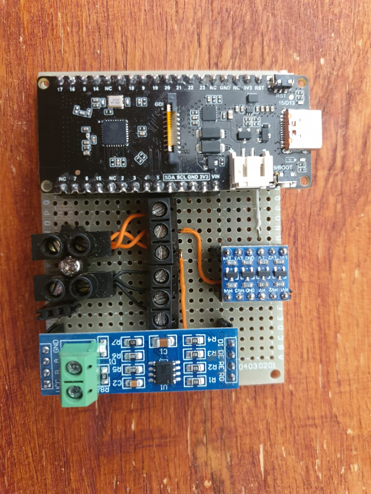
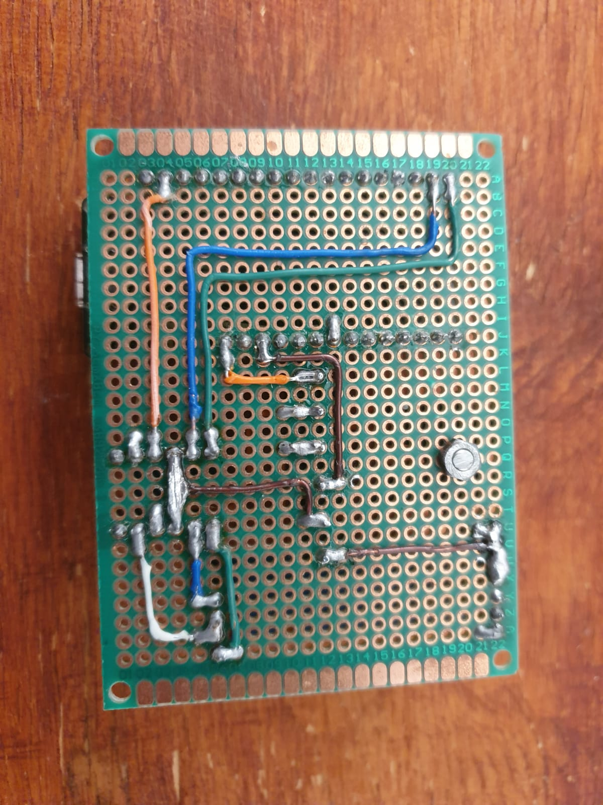
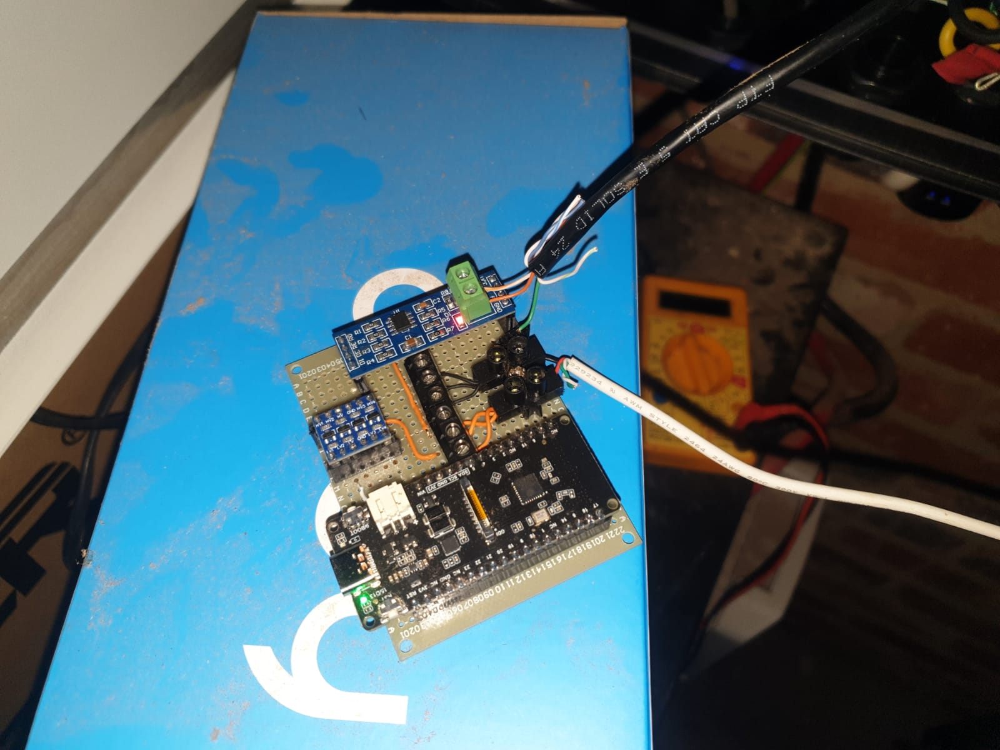
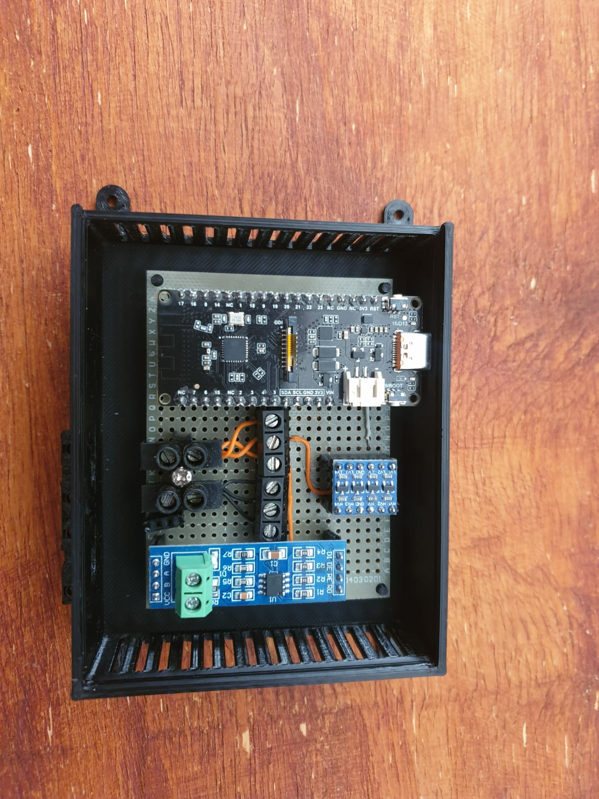

# deye-inverter-data-logger
Deye 12kW Inverter Data Logger

This repository contains my ESPHome-based Deye inverter data logger setup, case files, and build progress photos.

## ESPHome Configuration

- Main config: [esp_home_config/esp_inverter_v1.yaml](esp_home_config/esp_inverter_v1.yaml)

## Case Files (3D Print)

- Case body: [case_files/case_prototype_v5.stl](case_files/case_prototype_v5.stl)
- Case lid: [case_files/case_lid.stl](case_files/case_lid.stl)

## Inverter Communications Note

I had to use the **meter RS485 RJ11 port** on the Deye inverter.

Using the inverter Modbus port resulted in either:
- No communications
- CRC errors

If you see similar comms/CRC issues, try the meter RS485 RJ11 port first.

## Progress Pictures

- Folder: [progress_pics](progress_pics)

### Board Top

### Board Bottom

### Live Testing

### Board In Case

